<div align="center">



**A curated library of 114 battle-tested AI agent definitions across 15 categories.**
**Copy-paste ready for any LLM — OpenAI, Claude, Gemini, Llama, and more.**

[](LICENSE)
[](#-categories)
[](#-categories)
[](https://github.com/Shineii86/AgentSpace/stargazers)
[](https://github.com/Shineii86/AgentSpace/network/members)
[](https://github.com/Shineii86/AgentSpace/issues)
[](https://github.com/Shineii86/AgentSpace/commits/main)

`ai-agents` `llm` `prompt-engineering` `agent-definitions` `system-prompts` `openai` `claude` `gemini` `chatgpt` `copilot` `cursor` `openclaw`

*Every agent follows a consistent structure:*

***Role → Inputs → Process → Output Format → Guidelines***

</div>

## 📖 Table of Contents

- [Why AgentSpace?](#-why-agentspace)
- [Categories](#-categories)
  - [📊 Evaluation](#-evaluation)
  - [💻 Development](#-development)
  - [✍️ Content](#%EF%B8%8F-content)
  - [🔬 Research](#-research)
  - [⚙️ Operations](#%EF%B8%8F-operations)
  - [📨 Communication](#-communication)
  - [🐙 GitHub](#-github)
  - [🔌 API](#-api)
  - [🌐 Web & Frontend](#-web--frontend)
  - [🗄️ Backend](#%EF%B8%8F-backend)
  - [🖥️ Systems](#%EF%B8%8F-systems)
  - [📊 Data & Query](#-data--query)
  - [⚙️ Scripting & Automation](#%EF%B8%8F-scripting--automation)
  - [📝 Config / Markup / Data Formats](#-config--markup--data-formats)
  - [Frameworks](#-frameworks)
- [Agent Definition Format](#-agent-definition-format)
- [Usage](#-usage)
- [Contributing](#-contributing)
- [License](#-license)

---

## 🤔 Why AgentSpace?

Agent definitions are the **"source code"** of AI agents. They tell an AI:

> *What to do* • *How to do it* • *What the output should look like*

**AgentSpace** provides a library of **battle-tested agent definitions** you can:

- 📋 **Copy & paste** into any LLM system prompt
- 🔧 **Customize** for your specific use case
- 🧩 **Compose** multiple agents into complex workflows
- 📚 **Learn** structured prompt engineering patterns

---

## 📂 Categories

<div align="center">

| Category | Agents | Description |
|:---------|:------:|:------------|
| [📊 Evaluation](#-evaluation) | 4 | Judge, compare, grade, and experiment |
| [💻 Development](#-development) | 6 | Write, review, debug, test, audit, and architect |
| [✍️ Content](#%EF%B8%8F-content) | 5 | Create, edit, summarize, translate, and socialize |
| [🔬 Research](#-research) | 4 | Investigate, verify, analyze, and compete |
| [⚙️ Operations](#%EF%B8%8F-operations) | 4 | Deploy, monitor, schedule, and postmortem |
| [📨 Communication](#-communication) | 2 | Draft emails and summarize meetings |
| [🐙 GitHub](#-github) | 27 | Full GitHub ecosystem coverage |
| [🔌 API](#-api) | 12 | Design, build, scrape, test, and document APIs |
| [🌐 Web & Frontend](#-web--frontend) | 6 | CSS, React, accessibility, performance, responsive design, design systems |
| [🗄️ Backend](#%EF%B8%8F-backend) | 6 | API servers, databases, auth, microservices, caching, middleware |
| [🖥️ Systems](#%EF%B8%8F-systems) | 6 | Shell scripting, Linux admin, networking, containers, systemd, log analysis |
| [📊 Data & Query](#-data--query) | 6 | SQL, ETL, data modeling, GraphQL, time series, search engines |
| [⚙️ Scripting & Automation](#%EF%B8%8F-scripting--automation) | 6 | Task runners, CI/CD, workflows, cron, CLI tools, templates |
| [📝 Config / Markup / Data Formats](#-config--markup--data-formats) | 6 | YAML, JSON, TOML, Markdown, environment config, XML/HTML |
| [Frameworks](#-frameworks) | 13 | Next.js, React, Vue, Angular, Svelte, Astro, Express, Vite, Webpack |

</div>

---

### 📊 Evaluation

*Agents for judging, comparing, and grading outputs.*

- [**ANALYZER**](evaluation/ANALYZER.md) — Post-hoc analysis of blind comparison results. Examines why the winner won and generates actionable improvement suggestions for the loser.
- [**COMPARATOR**](evaluation/COMPARATOR.md) — Blind comparison of two outputs without bias. Uses structured rubrics (content + structure) to determine a winner based purely on quality.
- [**GRADER**](evaluation/GRADER.md) — Evaluate expectations against execution transcripts. Grades pass/fail with evidence, critiques weak evals, and surfaces hidden claims.
- [**A-B-TESTER**](evaluation/A-B-TESTER.md) — Design A/B tests with sample size calculation, metric selection, statistical analysis, and decision frameworks.

---

### 💻 Development

*Agents for the full software development lifecycle.*

- [**CODER**](development/CODER.md) — Write clean, production-ready code from specifications. Handles design, implementation, testing, and self-review in one pass.
- [**REVIEWER**](development/REVIEWER.md) — Structured code reviews covering correctness, security, performance, maintainability, and style. Produces actionable feedback with severity levels.
- [**DEBUGGER**](development/DEBUGGER.md) — Systematic bug diagnosis following a methodology: understand → reproduce → analyze → hypothesize → test → fix → prevent.
- [**TESTER**](development/TESTER.md) — Generate comprehensive test suites covering happy paths, edge cases, error conditions, and security scenarios.
- [**SECURITY-AUDITOR**](development/SECURITY-AUDITOR.md) — Comprehensive security audits for codebases. Scans for injection, auth flaws, data exposure, and crypto issues with remediation guidance.
- [**ARCHITECTURE**](development/ARCHITECTURE.md) — Generate Architecture Decision Records (ADRs), design docs, and RFCs that capture technical decisions and their rationale.

---

### ✍️ Content

*Agents for creating, editing, and transforming written content.*

- [**WRITER**](content/WRITER.md) — Generate high-quality content tailored to audience, tone, and format. Supports blog posts, docs, tutorials, emails, and reports.
- [**EDITOR**](content/EDITOR.md) — Review and improve existing content at structural, line, and proofreading levels. Preserves the author's voice while improving clarity.
- [**SUMMARIZER**](content/SUMMARIZER.md) — Create concise, accurate summaries. Supports executive, technical, bullet-point, and brief formats with configurable compression.
- [**TRANSLATOR**](content/TRANSLATOR.md) — Translate content between languages with cultural adaptation. Handles idioms, technical terms, and preserves formatting.
- [**SOCIAL-MEDIA**](content/SOCIAL-MEDIA.md) — Generate platform-optimized social media posts for Twitter/X, LinkedIn, Reddit, and Discord with engagement strategies.

---

### 🔬 Research

*Agents for investigating topics, verifying claims, and analyzing data.*

- [**RESEARCHER**](research/RESEARCHER.md) — Conduct thorough research from multiple sources. Produces structured reports with executive summary, findings, analysis, and citations.
- [**FACT-CHECKER**](research/FACT-CHECKER.md) — Verify claims with a 7-level rating system (TRUE → FALSE). Extracts implicit claims, checks logical validity, and flags misleading statements.
- [**DATA-ANALYST**](research/DATA-ANALYST.md) — Analyze datasets with descriptive, diagnostic, predictive, and comparative methods. Identifies patterns, anomalies, and actionable insights.
- [**COMPETITIVE-ANALYSIS**](research/COMPETITIVE-ANALYSIS.md) — Analyze competitors with feature comparison, pricing, SWOT analysis, and market positioning to inform strategy.

---

### ⚙️ Operations

*Agents for deploying, monitoring, and managing infrastructure.*

- [**DEPLOYER**](operations/DEPLOYER.md) — Manage deployments with pre-flight checks, rolling/blue-green/canary strategies, post-deployment verification, and automatic rollback.
- [**MONITOR**](operations/MONITOR.md) — Track system health across availability, latency, errors, and resources. Detects anomalies and generates severity-rated alerts.
- [**SCHEDULER**](operations/SCHEDULER.md) — Plan task schedules with dependency graphs, critical path analysis, resource allocation, and risk assessment.
- [**POSTMORTEM**](operations/POSTMORTEM.md) — Generate blameless incident postmortems with timeline reconstruction, 5-Whys root cause analysis, and action items.

---

### 📨 Communication

*Agents for professional communication and meeting management.*

- [**EMAIL-DRAFTER**](communication/EMAIL-DRAFTER.md) — Compose professional emails adapted to recipient, context, and goal. Supports follow-ups, requests, bad news, and introductions.
- [**MEETING-SUMMARIZER**](communication/MEETING-SUMMARIZER.md) — Transform raw meeting notes into structured records with decisions, action items, discussion summaries, and blockers.

---

### 🐙 GitHub

*The largest category — 28 agents covering the complete GitHub ecosystem.*

#### 📝 Documentation & Content

- [**README-WRITER**](github/README-WRITER.md) — Generate comprehensive README files with installation, usage, API reference, and contributing sections.
- [**WIKI-WRITER**](github/WIKI-WRITER.md) — Create structured wiki documentation with interconnected pages for architecture, guides, and references.
- [**DOCS-WRITER**](github/DOCS-WRITER.md) — Generate technical documentation including API references, tutorials, guides, and architecture docs.
- [**CONTRIBUTING-GUIDE**](github/CONTRIBUTING-GUIDE.md) — Create welcoming contributing guidelines with setup instructions, workflow, code standards, and PR process.
- [**MIGRATION-GUIDE**](github/MIGRATION-GUIDE.md) — Generate version migration guides with before/after code examples, automated tooling, and rollback instructions.

#### 🔄 Releases & Changelogs

- [**RELEASE-WRITER**](github/RELEASE-WRITER.md) — Create polished release notes from commits and PRs. Categorizes changes, flags breaking changes, and credits contributors.
- [**CHANGELOG-WRITER**](github/CHANGELOG-WRITER.md) — Generate structured changelogs following Keep a Changelog format. Groups by Added/Changed/Fixed/Removed/Security.
- [**COMMIT-MESSAGE**](github/COMMIT-MESSAGE.md) — Generate conventional commit messages from diffs. Follows type(scope): description format with body and footer.

#### 🐛 Issues & PRs

- [**PR-DESCRIPTION**](github/PR-DESCRIPTION.md) — Generate clear PR descriptions with summary, changes, testing instructions, and checklists.
- [**ISSUE-TEMPLATE**](github/ISSUE-TEMPLATE.md) — Create structured issue templates for bug reports, feature requests, security vulnerabilities, and questions.
- [**ISSUE-TRIAGER**](github/ISSUE-TRIAGER.md) — Automatically categorize, prioritize, and route issues. Checks completeness and suggests follow-up questions.

#### 🔧 CI/CD & Security

- [**CI-CD-WRITER**](github/CI-CD-WRITER.md) — Generate GitHub Actions workflows for CI, CD, releases, and scheduled jobs. Includes caching, matrix builds, and security best practices.
- [**GITHUB-ACTIONS-AUDITOR**](github/GITHUB-ACTIONS-AUDITOR.md) — Audit existing workflows for security risks (unpinned actions, secret exposure), performance issues, and best practices.
- [**SECURITY-POLICY**](github/SECURITY-POLICY.md) — Generate SECURITY.md with reporting instructions, response timelines, disclosure policy, and safe harbor provisions.
- [**CODEOWNERS-GENERATOR**](github/CODEOWNERS-GENERATOR.md) — Generate CODEOWNERS files that automatically assign reviewers based on which files are changed.
- [**DEPENDENCY-AUDITOR**](github/DEPENDENCY-AUDITOR.md) — Audit dependencies for security vulnerabilities, license compliance, update status, and overall health.

#### 🏗️ Project Setup & Management

- [**REPO-SETUP**](github/REPO-SETUP.md) — Bootstrap new repos with .gitignore, .editorconfig, LICENSE, CI workflows, issue templates, and Dependabot config.
- [**REPO-HEALTH**](github/REPO-HEALTH.md) — Score repository health across documentation, code quality, community, security, and maintenance dimensions.
- [**LABEL-MANAGER**](github/LABEL-MANAGER.md) — Design label taxonomies with consistent naming, meaningful colors, and clear descriptions for issues and PRs.
- [**BADGE-GENERATOR**](github/BADGE-GENERATOR.md) — Generate shields.io badges for build status, coverage, version, license, downloads, and community metrics.
- [**FUNDING-SETUP**](github/FUNDING-SETUP.md) — Generate FUNDING.yml for GitHub Sponsors, Open Collective, Ko-fi, and other monetization platforms.
- [**MARKDOWN-GUIDE**](github/MARKDOWN-GUIDE.md) — Generate GitHub Flavored Markdown cheatsheets, tutorials, and best practices guides.
- [**PROFILE-OPTIMIZER**](github/PROFILE-OPTIMIZER.md) — Generate optimized GitHub profile READMEs with stats widgets and tech stacks.
- [**API-REFERENCE**](github/API-REFERENCE.md) — Generate comprehensive API reference documentation with examples.
- [**ARCHITECTURE-DIAGRAM**](github/ARCHITECTURE-DIAGRAM.md) — Generate Mermaid diagrams for system architecture and data flows.
- [**OPEN-SOURCE-GUIDE**](github/OPEN-SOURCE-GUIDE.md) — Generate guides for open source maintainers, governance, and sustainability.
- [**DISCUSSION-WRITER**](github/DISCUSSION-WRITER.md) — Generate GitHub Discussions posts for announcements, proposals, Q&A, and community engagement.
- [**CODE-DOCUMENTATION-STANDARDS**](github/CODE-DOCUMENTATION-STANDARDS.md) — Reference template for writing well-documented, maintainable code with consistent conventions.

---

### 🔌 API

*The complete API lifecycle — from design to deployment to monitoring.*

#### 📐 Design & Build

- [**API-DESIGNER**](api/API-DESIGNER.md) — Design REST, GraphQL, and gRPC API schemas with contracts, validation rules, and error formats.
- [**API-BUILDER**](api/API-BUILDER.md) — Generate production-ready API server code from specs. Routes, handlers, validation, error handling, and tests.
- [**API-CLIENT**](api/API-CLIENT.md) — Generate type-safe SDK/client libraries from API specs. TypeScript, Python, Go, Java, Ruby.
- [**API-MOCK**](api/API-MOCK.md) — Create mock API servers with realistic data, delays, error simulation, and stateful CRUD.

#### 🕷️ Data & Scraping

- [**API-SCRAPER**](api/API-SCRAPER.md) — Scrape websites, HTML tables, JSON-LD, and API docs to create structured, queryable APIs.
- [**API-TRANSFORMER**](api/API-TRANSFORMER.md) — Transform data between formats: REST↔GraphQL, SOAP↔REST, CSV↔JSON, flat↔nested.
- [**API-MIGRATION**](api/API-MIGRATION.md) — Migrate between API versions, formats, and protocols with compatibility layers and rollback plans.

#### 🔧 Infrastructure

- [**API-GATEWAY**](api/API-GATEWAY.md) — Design API gateway configs for routing, auth, rate limiting, and observability (Kong, Nginx, AWS).
- [**API-MONITOR**](api/API-MONITOR.md) — Design monitoring with SLIs, SLOs, dashboards, alerts, and health check scripts.
- [**API-SECURITY**](api/API-SECURITY.md) — Audit and harden API security against OWASP API Top 10. Auth, validation, rate limiting, headers.

#### 📋 Testing & Documentation

- [**API-TESTER**](api/API-TESTER.md) — Generate comprehensive test suites: functional, contract, edge cases, auth, and error handling.
- [**API-DOCUMENTATION**](api/API-DOCUMENTATION.md) — Generate interactive API docs with Redoc, Swagger, or custom platforms. Working examples included.

---

### 🌐 Web & Frontend

*Agents for building modern web interfaces — from CSS architecture to design systems.*

- [**CSS-ARCHITECT**](web-frontend/CSS-ARCHITECT.md) — Design scalable, maintainable CSS architectures. BEM, ITCSS, utility-first, design tokens, theming strategies.
- [**REACT-ENGINEER**](web-frontend/REACT-ENGINEER.md) — Build production-grade React applications with hooks, server components, state management, and TypeScript.
- [**ACCESSIBILITY-AUDITOR**](web-frontend/ACCESSIBILITY-AUDITOR.md) — Audit and remediate web interfaces for WCAG 2.2 AA/AAA compliance. Keyboard, screen reader, color contrast.
- [**PERFORMANCE-OPTIMIZER**](web-frontend/PERFORMANCE-OPTIMIZER.md) — Diagnose and fix Core Web Vitals (LCP, INP, CLS). Bundle optimization, caching, loading strategies.
- [**RESPONSIVE-DESIGNER**](web-frontend/RESPONSIVE-DESIGNER.md) — Design fluid, responsive layouts with CSS Grid, Flexbox, container queries, and fluid typography.
- [**DESIGN-SYSTEM-BUILDER**](web-frontend/DESIGN-SYSTEM-BUILDER.md) — Build and maintain scalable design systems with tokens, components, documentation, and governance.

---

### 🗄️ Backend

*Agents for server-side development — APIs, databases, authentication, and distributed systems.*

- [**API-SERVER-BUILDER**](backend/API-SERVER-BUILDER.md) — Build production-ready API servers with clean architecture, middleware, validation, error handling, and observability.
- [**DATABASE-ENGINEER**](backend/DATABASE-ENGINEER.md) — Design schemas, optimize queries, write migrations, and manage database operations across SQL and NoSQL engines.
- [**AUTH-ARCHITECT**](backend/AUTH-ARCHITECT.md) — Design authentication and authorization systems. OAuth 2.0, JWT, RBAC/ABAC, MFA, social login, SSO.
- [**MICROSERVICE-ARCHITECT**](backend/MICROSERVICE-ARCHITECT.md) — Design microservice architectures with bounded contexts, communication patterns, resilience, and observability.
- [**CACHING-STRATEGIST**](backend/CACHING-STRATEGIST.md) — Design multi-layer caching strategies. Browser, CDN, application, and database caching with invalidation.
- [**MIDDLEWARE-DESIGNER**](backend/MIDDLEWARE-DESIGNER.md) — Design reusable middleware pipelines for auth, logging, validation, rate limiting, and error handling.

---

### 🖥️ Systems

*Agents for system administration, infrastructure, and DevOps — from shell scripts to containers.*

- [**SHELL-SCRIPTER**](systems/SHELL-SCRIPTER.md) — Write robust, portable shell scripts with proper error handling, argument parsing, and safety patterns.
- [**LINUX-ADMIN**](systems/LINUX-ADMIN.md) — Manage Linux systems: packages, services, users, networking, storage, and security hardening.
- [**NETWORK-ENGINEER**](systems/NETWORK-ENGINEER.md) — Design and troubleshoot network infrastructure. DNS, load balancing, firewalls, VPNs, TCP tuning.
- [**CONTAINER-SPECIALIST**](systems/CONTAINER-SPECIALIST.md) — Build optimized Docker images, manage orchestration, implement security hardening and health checks.
- [**SYSTEMD-ENGINEER**](systems/SYSTEMD-ENGINEER.md) — Design systemd services, timers, socket activation, resource controls, and security sandboxing.
- [**LOG-ANALYZER**](systems/LOG-ANALYZER.md) — Analyze system, application, and security logs. Pattern detection, anomaly identification, root cause analysis.

---

### 📊 Data & Query

*Agents for data engineering, querying, and analysis — SQL to search engines.*

- [**SQL-ENGINEER**](data-query/SQL-ENGINEER.md) — Write optimized SQL queries, analyze execution plans, design schemas, and handle complex analytical queries.
- [**ETL-DESIGNER**](data-query/ETL-DESIGNER.md) — Design ETL/ELT data pipelines with extraction, transformation, loading, quality checks, and monitoring.
- [**DATA-MODELER**](data-query/DATA-MODELER.md) — Design conceptual, logical, and physical data models. ERDs, normalization, denormalization, data dictionaries.
- [**GRAPHQL-ARCHITECT**](data-query/GRAPHQL-ARCHITECT.md) — Design GraphQL schemas, resolvers, federation, pagination, authorization, and N+1 prevention.
- [**TIME-SERIES-ANALYST**](data-query/TIME-SERIES-ANALYST.md) — Analyze temporal data patterns, design time-series storage, detect anomalies, and build aggregations.
- [**SEARCH-ENGINEER**](data-query/SEARCH-ENGINEER.md) — Design full-text search with Elasticsearch/OpenSearch. Autocomplete, relevance tuning, faceting, and indexing.

---

### ⚙️ Scripting & Automation

*Agents for automating workflows, CI/CD pipelines, and developer productivity tooling.*

- [**TASK-RUNNER**](scripting-automation/TASK-RUNNER.md) — Design task automation with Make, Just, Taskfile. Dependency tracking, self-documenting help, parallel execution.
- [**CI-CD-ENGINEER**](scripting-automation/CI-CD-ENGINEER.md) — Design CI/CD pipelines with testing, building, deployment strategies, gates, caching, and rollback.
- [**WORKFLOW-AUTOMATOR**](scripting-automation/WORKFLOW-AUTOMATOR.md) — Automate repetitive workflows and integrations. Webhooks, API connections, error handling, monitoring.
- [**CRON-SCHEDULER**](scripting-automation/CRON-SCHEDULER.md) — Design reliable scheduled tasks. Timezone handling, idempotency, overlap prevention, missed run recovery.
- [**CLI-BUILDER**](scripting-automation/CLI-BUILDER.md) — Build user-friendly CLI tools with argument parsing, help systems, error handling, and progress indicators.
- [**TEMPLATE-ENGINE**](scripting-automation/TEMPLATE-ENGINE.md) — Design code generation, scaffolding, and template systems for projects, components, and configurations.

---


### 📝 Config / Markup / Data Formats

*Agents for configuration languages, markup formats, and data interchange.*

- [**YAML-SPECIALIST**](config-formats/YAML-SPECIALIST.md) — Write, validate, and optimize YAML for Kubernetes, Docker Compose, CI/CD, Ansible, and Helm.
- [**JSON-ARCHITECT**](config-formats/JSON-ARCHITECT.md) — Design JSON data structures, write JSON Schema definitions, and handle transformations with jq.
- [**TOML-EXPERT**](config-formats/TOML-EXPERT.md) — Write TOML configurations for Cargo, pyproject.toml, and modern CLI tools. Migrations and validation.
- [**MARKDOWN-ENGINEER**](config-formats/MARKDOWN-ENGINEER.md) — Write structured Markdown for docs, READMEs, and technical content. Mermaid diagrams, tables, cross-references.
- [**ENV-CONFIG-MANAGER**](config-formats/ENV-CONFIG-MANAGER.md) — Design environment configurations, .env files, secret management, and feature flag systems.
- [**XML-HTML-SPECIALIST**](config-formats/XML-HTML-SPECIALIST.md) — Write and validate XML/HTML. Schema design (XSD/DTD), XSLT transforms, semantic HTML5 markup.

---

### Frameworks

*Agents for modern web frameworks and build tools — from full-stack meta-frameworks to bundlers.*

#### Full-Stack & Meta-Frameworks

- [**NEXTJS**](frameworks/NEXTJS.md) — Build production-grade Next.js applications with App Router, server components, and full-stack capabilities.
- [**NUXT**](frameworks/NUXT.md) — Build full-stack Nuxt applications with server routes, auto-imports, and hybrid rendering strategies.
- [**SVELTEKIT**](frameworks/SVELTEKIT.md) — Build full-stack SvelteKit applications with server-side rendering, form actions, and edge deployment.
- [**REMIX**](frameworks/REMIX.md) — Build resilient, progressively enhanced web applications with Remix's web-standard approach and nested routing.
- [**GATSBY**](frameworks/GATSBY.md) — Build fast, SEO-optimized static sites and progressive web apps with Gatsby's GraphQL data layer.
- [**ASTRO**](frameworks/ASTRO.md) — Build fast, content-focused websites with Astro's island architecture and zero-JS-by-default approach.

#### UI Frameworks

- [**REACT**](frameworks/REACT.md) — Build modern React applications with hooks, concurrent features, and component architecture best practices.
- [**VUE**](frameworks/VUE.md) — Build modern Vue.js applications with the Composition API, reactivity system, and component architecture.
- [**ANGULAR**](frameworks/ANGULAR.md) — Build enterprise-grade Angular applications with signals, standalone components, and dependency injection.
- [**SVELTE**](frameworks/SVELTE.md) — Build fast, lightweight web applications with Svelte's compile-time reactivity and minimal boilerplate.

#### Backend & Build Tools

- [**EXPRESS**](frameworks/EXPRESS.md) — Build robust, production-ready Node.js APIs and web servers with Express.js middleware architecture.
- [**VITE**](frameworks/VITE.md) — Configure and optimize Vite-based build pipelines for fast development and production-optimized bundles.
- [**WEBPACK**](frameworks/WEBPACK.md) — Configure and optimize Webpack build pipelines for complex applications requiring fine-grained bundle control.

---

## 📋 Agent Definition Format

Every agent in AgentSpace follows this **6-section structure**:

```markdown
# Agent Name

One-line description of what the agent does.

## Role
What the agent is responsible for and its core behavior.

## Inputs
Parameters the agent receives (names, types, descriptions).

## Process
Step-by-step methodology the agent follows (numbered steps).

## Output Format
JSON or Markdown template showing the expected output structure.

## Guidelines
Do's and don'ts, best practices, and edge cases.
```

**Why this format works:**
- 🎯 **Role** sets clear boundaries — what the agent does and doesn't do
- 📥 **Inputs** make agents composable — you know exactly what to pass in
- 🔄 **Process** ensures consistency — same methodology every time
- 📤 **Output Format** enables automation — structured, predictable outputs
- 📏 **Guidelines** encode expertise — best practices and gotchas

---

## 🛠️ Usage

### With OpenClaw
Agent definitions can be loaded as skill prompts. Point your agent at the definition file and provide the required inputs.

### With Any LLM
Copy the agent definition into your system prompt or use it as a template for your own agents.

### As Templates
Each agent is a starting point — customize the process, add domain-specific steps, or combine multiple agents into workflows.

### Customization
1. 🍴 **Fork** this repository
2. ✏️ **Modify** existing agents to match your needs
3. ➕ **Add** new agents following the [standard format](#-agent-definition-format)
4. 📬 **Submit a PR** to share with the community

---

## 📝 Contributing

We welcome contributions! See [CONTRIBUTING.md](CONTRIBUTING.md) for guidelines.

**Ways to contribute:**
- 🐛 Report issues with existing agents
- 💡 Suggest new agent types
- ✏️ Improve existing agent definitions
- 📚 Add documentation and examples
- 🧪 Share how you use AgentSpace agents

---

## 📄 License

This project is licensed under the MIT License — see [LICENSE](LICENSE) for details.

---

<div align="center">

**Built with ❤️ for the AI agent community**

[⬆ Back to top](#-agentspace)

</div>
