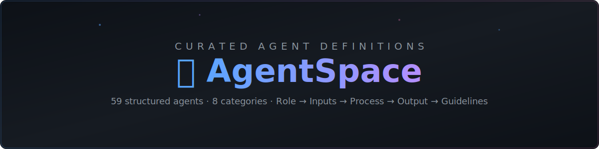

<div align="center">



[](LICENSE)
[](#-categories)
[](#-categories)
[](https://github.com/Shineii86/AgentSpace/stargazers)
[](https://github.com/Shineii86/AgentSpace/issues)
[](https://github.com/Shineii86/AgentSpace/commits/main)

*Every agent follows a consistent structure: **Role → Inputs → Process → Output Format → Guidelines***

</div>

## 📖 Table of Contents

- [Why AgentSpace?](#-why-agentspace)
- [Categories](#-categories)
  - [📊 Evaluation](#-evaluation)
  - [💻 Development](#-development)
  - [✍️ Content](#%EF%B8%8F-content)
  - [🔬 Research](#-research)
  - [⚙️ Operations](#%EF%B8%8F-operations)
  - [📨 Communication](#-communication)
  - [🐙 GitHub](#-github)
- [Agent Definition Format](#-agent-definition-format)
- [Usage](#-usage)
- [Contributing](#-contributing)
- [License](#-license)

---

## 🤔 Why AgentSpace?

Agent definitions are the **"source code"** of AI agents. They tell an AI:

> *What to do* • *How to do it* • *What the output should look like*

**AgentSpace** provides a library of **battle-tested agent definitions** you can:

- 📋 **Copy & paste** into any LLM system prompt
- 🔧 **Customize** for your specific use case
- 🧩 **Compose** multiple agents into complex workflows
- 📚 **Learn** structured prompt engineering patterns

---

## 📂 Categories

<div align="center">

| Category | Agents | Description |
|:---------|:------:|:------------|
| [📊 Evaluation](#-evaluation) | 3 | Judge, compare, and grade outputs |
| [💻 Development](#-development) | 4 | Write, review, debug, and test code |
| [✍️ Content](#%EF%B8%8F-content) | 4 | Create, edit, summarize, and translate text |
| [🔬 Research](#-research) | 3 | Investigate, verify, and analyze data |
| [⚙️ Operations](#%EF%B8%8F-operations) | 3 | Deploy, monitor, and schedule tasks |
| [📨 Communication](#-communication) | 2 | Draft emails and summarize meetings |
| [🐙 GitHub](#-github) | 22 | Full GitHub ecosystem coverage |

</div>

---

<div align="center">

</div>

### 📊 Evaluation

> *Agents for judging, comparing, and grading outputs.*

<table>
<tr>
<td width="30%"><strong><a href="evaluation/ANALYZER.md">ANALYZER</a></strong></td>
<td>Post-hoc analysis of blind comparison results. Examines why the winner won and generates actionable improvement suggestions for the loser.</td>
</tr>
<tr>
<td><strong><a href="evaluation/COMPARATOR.md">COMPARATOR</a></strong></td>
<td>Blind comparison of two outputs without bias. Uses structured rubrics (content + structure) to determine a winner based purely on quality.</td>
</tr>
<tr>
<td><strong><a href="evaluation/GRADER.md">GRADER</a></strong></td>
<td>Evaluate expectations against execution transcripts. Grades pass/fail with evidence, critiques weak evals, and surfaces hidden claims.</td>
</tr>
</table>

---

<div align="center">

</div>

### 💻 Development

> *Agents for the full software development lifecycle.*

<table>
<tr>
<td width="30%"><strong><a href="development/CODER.md">CODER</a></strong></td>
<td>Write clean, production-ready code from specifications. Handles design, implementation, testing, and self-review in one pass.</td>
</tr>
<tr>
<td><strong><a href="development/REVIEWER.md">REVIEWER</a></strong></td>
<td>Structured code reviews covering correctness, security, performance, maintainability, and style. Produces actionable feedback with severity levels.</td>
</tr>
<tr>
<td><strong><a href="development/DEBUGGER.md">DEBUGGER</a></strong></td>
<td>Systematic bug diagnosis following a methodology: understand → reproduce → analyze → hypothesize → test → fix → prevent.</td>
</tr>
<tr>
<td><strong><a href="development/TESTER.md">TESTER</a></strong></td>
<td>Generate comprehensive test suites covering happy paths, edge cases, error conditions, and security scenarios.</td>
</tr>
</table>

---

<div align="center">

</div>

### ✍️ Content

> *Agents for creating, editing, and transforming written content.*

<table>
<tr>
<td width="30%"><strong><a href="content/WRITER.md">WRITER</a></strong></td>
<td>Generate high-quality content tailored to audience, tone, and format. Supports blog posts, docs, tutorials, emails, and reports.</td>
</tr>
<tr>
<td><strong><a href="content/EDITOR.md">EDITOR</a></strong></td>
<td>Review and improve existing content at structural, line, and proofreading levels. Preserves the author's voice while improving clarity.</td>
</tr>
<tr>
<td><strong><a href="content/SUMMARIZER.md">SUMMARIZER</a></strong></td>
<td>Create concise, accurate summaries. Supports executive, technical, bullet-point, and brief formats with configurable compression.</td>
</tr>
<tr>
<td><strong><a href="content/TRANSLATOR.md">TRANSLATOR</a></strong></td>
<td>Translate content between languages with cultural adaptation. Handles idioms, technical terms, and preserves formatting.</td>
</tr>
</table>

---

<div align="center">

</div>

### 🔬 Research

> *Agents for investigating topics, verifying claims, and analyzing data.*

<table>
<tr>
<td width="30%"><strong><a href="research/RESEARCHER.md">RESEARCHER</a></strong></td>
<td>Conduct thorough research from multiple sources. Produces structured reports with executive summary, findings, analysis, and citations.</td>
</tr>
<tr>
<td><strong><a href="research/FACT-CHECKER.md">FACT-CHECKER</a></strong></td>
<td>Verify claims with a 7-level rating system (TRUE → FALSE). Extracts implicit claims, checks logical validity, and flags misleading statements.</td>
</tr>
<tr>
<td><strong><a href="research/DATA-ANALYST.md">DATA-ANALYST</a></strong></td>
<td>Analyze datasets with descriptive, diagnostic, predictive, and comparative methods. Identifies patterns, anomalies, and actionable insights.</td>
</tr>
</table>

---

<div align="center">

</div>

### ⚙️ Operations

> *Agents for deploying, monitoring, and managing infrastructure.*

<table>
<tr>
<td width="30%"><strong><a href="operations/DEPLOYER.md">DEPLOYER</a></strong></td>
<td>Manage deployments with pre-flight checks, rolling/blue-green/canary strategies, post-deployment verification, and automatic rollback.</td>
</tr>
<tr>
<td><strong><a href="operations/MONITOR.md">MONITOR</a></strong></td>
<td>Track system health across availability, latency, errors, and resources. Detects anomalies and generates severity-rated alerts.</td>
</tr>
<tr>
<td><strong><a href="operations/SCHEDULER.md">SCHEDULER</a></strong></td>
<td>Plan task schedules with dependency graphs, critical path analysis, resource allocation, and risk assessment.</td>
</tr>
</table>

---

<div align="center">

</div>

### 📨 Communication

> *Agents for professional communication and meeting management.*

<table>
<tr>
<td width="30%"><strong><a href="communication/EMAIL-DRAFTER.md">EMAIL-DRAFTER</a></strong></td>
<td>Compose professional emails adapted to recipient, context, and goal. Supports follow-ups, requests, bad news, and introductions.</td>
</tr>
<tr>
<td><strong><a href="communication/MEETING-SUMMARIZER.md">MEETING-SUMMARIZER</a></strong></td>
<td>Transform raw meeting notes into structured records with decisions, action items, discussion summaries, and blockers.</td>
</tr>
</table>

---

<div align="center">

</div>

### 🐙 GitHub

> *The largest category — 22 agents covering the complete GitHub ecosystem.*

#### 📝 Documentation & Content

<table>
<tr>
<td width="30%"><strong><a href="github/README-WRITER.md">README-WRITER</a></strong></td>
<td>Generate comprehensive README files with installation, usage, API reference, and contributing sections.</td>
</tr>
<tr>
<td><strong><a href="github/WIKI-WRITER.md">WIKI-WRITER</a></strong></td>
<td>Create structured wiki documentation with interconnected pages for architecture, guides, and references.</td>
</tr>
<tr>
<td><strong><a href="github/DOCS-WRITER.md">DOCS-WRITER</a></strong></td>
<td>Generate technical documentation including API references, tutorials, guides, and architecture docs.</td>
</tr>
<tr>
<td><strong><a href="github/CONTRIBUTING-GUIDE.md">CONTRIBUTING-GUIDE</a></strong></td>
<td>Create welcoming contributing guidelines with setup instructions, workflow, code standards, and PR process.</td>
</tr>
<tr>
<td><strong><a href="github/MIGRATION-GUIDE.md">MIGRATION-GUIDE</a></strong></td>
<td>Generate version migration guides with before/after code examples, automated tooling, and rollback instructions.</td>
</tr>
</table>

#### 🔄 Releases & Changelogs

<table>
<tr>
<td width="30%"><strong><a href="github/RELEASE-WRITER.md">RELEASE-WRITER</a></strong></td>
<td>Create polished release notes from commits and PRs. Categorizes changes, flags breaking changes, and credits contributors.</td>
</tr>
<tr>
<td><strong><a href="github/CHANGELOG-WRITER.md">CHANGELOG-WRITER</a></strong></td>
<td>Generate structured changelogs following Keep a Changelog format. Groups by Added/Changed/Fixed/Removed/Security.</td>
</tr>
<tr>
<td><strong><a href="github/COMMIT-MESSAGE.md">COMMIT-MESSAGE</a></strong></td>
<td>Generate conventional commit messages from diffs. Follows type(scope): description format with body and footer.</td>
</tr>
</table>

#### 🐛 Issues & PRs

<table>
<tr>
<td width="30%"><strong><a href="github/PR-DESCRIPTION.md">PR-DESCRIPTION</a></strong></td>
<td>Generate clear PR descriptions with summary, changes, testing instructions, and checklists.</td>
</tr>
<tr>
<td><strong><a href="github/ISSUE-TEMPLATE.md">ISSUE-TEMPLATE</a></strong></td>
<td>Create structured issue templates for bug reports, feature requests, security vulnerabilities, and questions.</td>
</tr>
<tr>
<td><strong><a href="github/ISSUE-TRIAGER.md">ISSUE-TRIAGER</a></strong></td>
<td>Automatically categorize, prioritize, and route issues. Checks completeness and suggests follow-up questions.</td>
</tr>
</table>

#### 🔧 CI/CD & Security

<table>
<tr>
<td width="30%"><strong><a href="github/CI-CD-WRITER.md">CI-CD-WRITER</a></strong></td>
<td>Generate GitHub Actions workflows for CI, CD, releases, and scheduled jobs. Includes caching, matrix builds, and security best practices.</td>
</tr>
<tr>
<td><strong><a href="github/GITHUB-ACTIONS-AUDITOR.md">GITHUB-ACTIONS-AUDITOR</a></strong></td>
<td>Audit existing workflows for security risks (unpinned actions, secret exposure), performance issues, and best practices.</td>
</tr>
<tr>
<td><strong><a href="github/SECURITY-POLICY.md">SECURITY-POLICY</a></strong></td>
<td>Generate SECURITY.md with reporting instructions, response timelines, disclosure policy, and safe harbor provisions.</td>
</tr>
<tr>
<td><strong><a href="github/CODEOWNERS-GENERATOR.md">CODEOWNERS-GENERATOR</a></strong></td>
<td>Generate CODEOWNERS files that automatically assign reviewers based on which files are changed.</td>
</tr>
<tr>
<td><strong><a href="github/DEPENDENCY-AUDITOR.md">DEPENDENCY-AUDITOR</a></strong></td>
<td>Audit dependencies for security vulnerabilities, license compliance, update status, and overall health.</td>
</tr>
</table>

#### 🏗️ Project Setup & Management

<table>
<tr>
<td width="30%"><strong><a href="github/REPO-SETUP.md">REPO-SETUP</a></strong></td>
<td>Bootstrap new repos with .gitignore, .editorconfig, LICENSE, CI workflows, issue templates, and Dependabot config.</td>
</tr>
<tr>
<td><strong><a href="github/REPO-HEALTH.md">REPO-HEALTH</a></strong></td>
<td>Score repository health across documentation, code quality, community, security, and maintenance dimensions.</td>
</tr>
<tr>
<td><strong><a href="github/LABEL-MANAGER.md">LABEL-MANAGER</a></strong></td>
<td>Design label taxonomies with consistent naming, meaningful colors, and clear descriptions for issues and PRs.</td>
</tr>
<tr>
<td><strong><a href="github/BADGE-GENERATOR.md">BADGE-GENERATOR</a></strong></td>
<td>Generate shields.io badges for build status, coverage, version, license, downloads, and community metrics.</td>
</tr>
<tr>
<td><strong><a href="github/FUNDING-SETUP.md">FUNDING-SETUP</a></strong></td>
<tr>
<td><strong><a href=github/MARKDOWN-GUIDE.md>MARKDOWN-GUIDE</a></strong></td>
<td>Generate GitHub Flavored Markdown cheatsheets, tutorials, and best practices guides.</td>
</tr>
<tr>
<td><strong><a href=github/PROFILE-OPTIMIZER.md>PROFILE-OPTIMIZER</a></strong></td>
<td>Generate optimized GitHub profile READMEs with stats widgets and tech stacks.</td>
</tr>
<tr>
<td><strong><a href=github/API-REFERENCE.md>API-REFERENCE</a></strong></td>
<td>Generate comprehensive API reference documentation with examples.</td>
</tr>
<tr>
<td><strong><a href=github/ARCHITECTURE-DIAGRAM.md>ARCHITECTURE-DIAGRAM</a></strong></td>
<td>Generate Mermaid diagrams for system architecture and data flows.</td>
</tr>
<tr>
<td><strong><a href=github/OPEN-SOURCE-GUIDE.md>OPEN-SOURCE-GUIDE</a></strong></td>
<td>Generate guides for open source maintainers, governance, and sustainability.</td>
</tr>
<td>Generate FUNDING.yml for GitHub Sponsors, Open Collective, Ko-fi, and other monetization platforms.</td>
</tr>
<tr>
<td><strong><a href="github/DISCUSSION-WRITER.md">DISCUSSION-WRITER</a></strong></td>
<td>Generate GitHub Discussions posts for announcements, proposals, Q&A, and community engagement.</td>
</tr>
</table>

---

## 📋 Agent Definition Format

Every agent in AgentSpace follows this **6-section structure**:

```markdown
# Agent Name

One-line description of what the agent does.

## Role
What the agent is responsible for and its core behavior.

## Inputs
Parameters the agent receives (names, types, descriptions).

## Process
Step-by-step methodology the agent follows (numbered steps).

## Output Format
JSON or Markdown template showing the expected output structure.

## Guidelines
Do's and don'ts, best practices, and edge cases.
```

**Why this format works:**
- 🎯 **Role** sets clear boundaries — what the agent does and doesn't do
- 📥 **Inputs** make agents composable — you know exactly what to pass in
- 🔄 **Process** ensures consistency — same methodology every time
- 📤 **Output Format** enables automation — structured, predictable outputs
- 📏 **Guidelines** encode expertise — best practices and gotchas

---

## 🛠️ Usage

### With OpenClaw
Agent definitions can be loaded as skill prompts. Point your agent at the definition file and provide the required inputs.

### With Any LLM
Copy the agent definition into your system prompt or use it as a template for your own agents.

### As Templates
Each agent is a starting point — customize the process, add domain-specific steps, or combine multiple agents into workflows.

### Customization
1. 🍴 **Fork** this repository
2. ✏️ **Modify** existing agents to match your needs
3. ➕ **Add** new agents following the [standard format](#-agent-definition-format)
4. 📬 **Submit a PR** to share with the community

---

## 📝 Contributing

We welcome contributions! See [CONTRIBUTING.md](CONTRIBUTING.md) for guidelines.

**Ways to contribute:**
- 🐛 Report issues with existing agents
- 💡 Suggest new agent types
- ✏️ Improve existing agent definitions
- 📚 Add documentation and examples
- 🧪 Share how you use AgentSpace agents

---

## 📄 License

This project is licensed under the MIT License — see [LICENSE](LICENSE) for details.

---

<div align="center">

**Built with ❤️ for the AI agent community**

[⬆ Back to top](#-agentspace)

</div>
